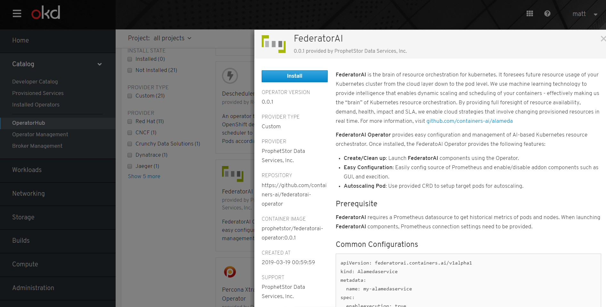
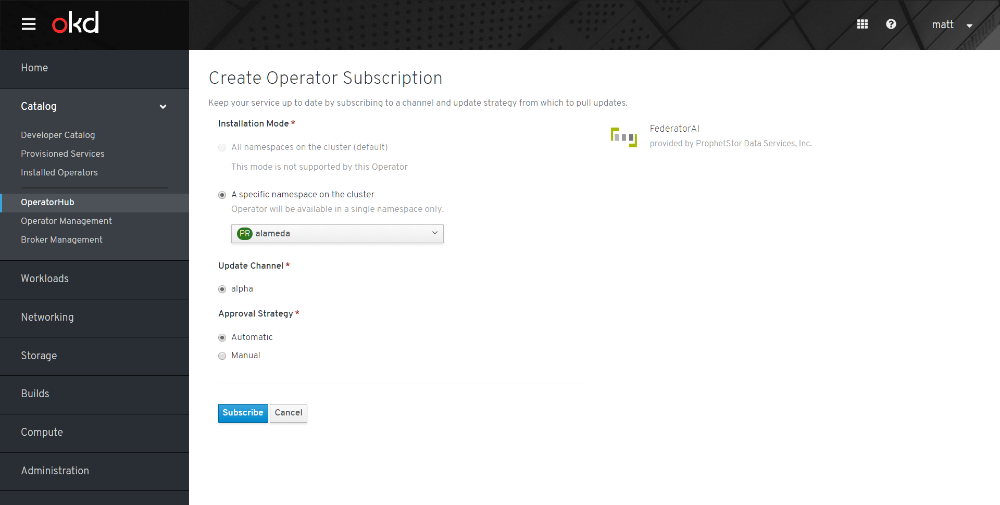
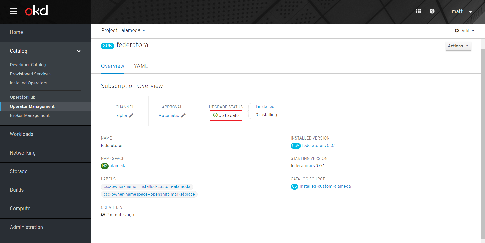
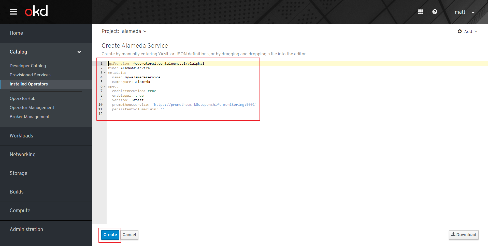

## Background

### OLM Architecture

[OLM Architecture](https://github.com/operator-framework/operator-lifecycle-manager/blob/274df58592c2ffd1d8ea56156c73c7746f57efc0/Documentation/design/architecture.md)

### Operator Framework Object Map


## Deploy Operator Framework

### Deploy OLM and Catalog Operator

```
$ git clone https://github.com/operator-framework/operator-lifecycle-manager.git
$ kubectl create -f deploy/upstream/manifests/latest/
```
Refer to [Install document](https://github.com/operator-framework/operator-lifecycle-manager/blob/master/Documentation/install/install.md) for details.

### Deploy Marketplace Operator

```
$ git clone https://github.com/operator-framework/operator-marketplace.git
$ kubectl apply -f deploy/upstream
```
Refer to [README.md](https://github.com/operator-framework/operator-marketplace/blob/master/README.md) for details.

> **Note:** If you need to visualize *OperatorHub* UI in OKD, please deploy market operator in *openshift-market* namespace.

### Visualize OperatorHub in OKD 3.11

1. Prepare an OKD 3.11 cluster
2. Edit openshift-console deployment to replace ```image: docker.io/openshift/origin-console:v3.11``` to ```image: docker.io/openshift/origin-console:v4.0.0```
```
$ oc edit pod console-67dd586f67-7bsxt -n openshift-console
```
3. login to openshift GUI at ```<your openshift cluster>/operatorhub/all-namespaces```

## Workflow

1. Operator developer prepares all [CSV](https://github.com/operator-framework/operator-lifecycle-manager/blob/master/Documentation/design/building-your-csv.md), CRD, and Package yamls.
2. Operator developer uses [```operator-courier```](https://github.com/operator-framework/operator-courier/#usage) to verify and push operator bundle to the Quay application repository.
3. Cluster admin creates [```OperatorSource```](https://github.com/operator-framework/operator-marketplace#description) CR to add the operator source into cluster. (All operators under the same Quay namespace share the same ```OperatorSource```)
4. Cluster admin creates [```CatalogSourceConfig```](https://github.com/operator-framework/operator-marketplace/blob/master/README.md#description) to enable selected operators in ```OperatorSource``` to ```CatalogSource```
5. Cluster admin creates [```OperatorGroup```](https://github.com/operator-framework/operator-lifecycle-manager/blob/master/Documentation/design/operatorgroups.md) for target namespaces where operators are going to be installed into.
6. Cluster admin creates ```Subscription``` to subscribe operators.
7. *Catalog Operator* will reconcile to ```Subscription``` and create ```InstallPlan```.
8. *Catalog Operator* will reconcile to ```InstallPlan``` and create corresponding ```ClusterServiceVersion```.
9. *OLM Operator* reconciles to ```ClusterServiceVersion``` and make operators started.
10. User creates CRs defined by operators to create services.

### Examples

1. Import **operatorsource** provided by Federator.ai
    ```
    $ kubectl apply -f prophetstor-operatorsource.yaml
    $ cat prophetstor-operatorsource.yaml
    apiVersion: operators.coreos.com/v1
    kind: OperatorSource
    metadata:
      name: prophetstor-operators
      namespace: openshift-marketplace
    spec:
      type: appregistry
      endpoint: https://quay.io/cnr
      registryNamespace: prophetstor
      displayName: "prophetstor Operators"
      publisher: "prophetstor"
    ```

    You should see the FederatorAI Operator in the UI.
    

2. Subscribe Federator.ai operator
    

3. Configure namespace and approval strategy
    

4. (Optional) Approve Federator.ai operator **InstallPlan** if you toggle *Manual* approval strategy when you were subscribing Federator.ai operator

5. Check subscription status
    

6. Check installed ClusterServiceVersion
    

7. When Federator.ai **ClusterServiceVersion** of Federator.ai operator is created, we can create an **AlamedaService** CR to start deploy Alameda
    

